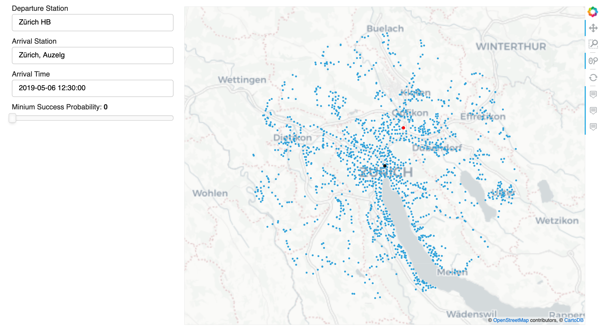

# Robust Journey Planning

[final_notebook](notebooks/final_notebook.ipynb) explains the structure of the project.

A short video explaining the project can be found [here](https://www.youtube.com/watch?v=tZWT6d0ZCrg&feature=youtu.be).

**Installation**
```
conda env create -f local_environment.yml
jupyter labextension install @pyviz/jupyterlab_pyviz
```

**Journey Planner Interface**


**Journey Visualization**

